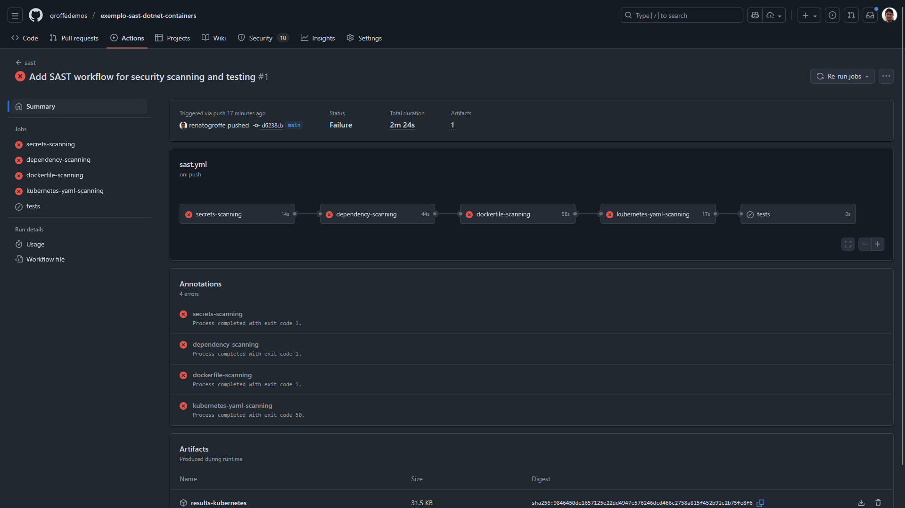
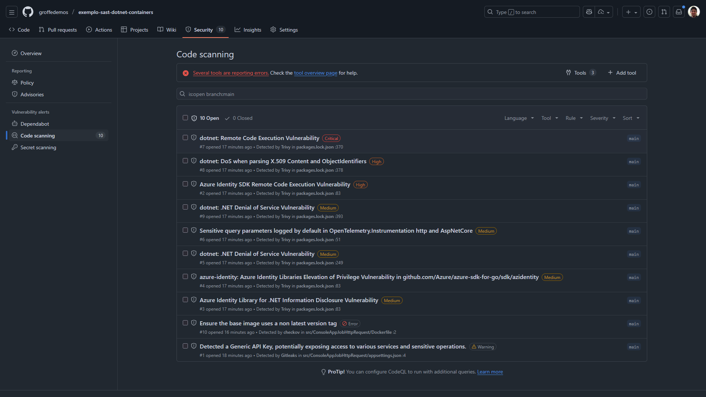
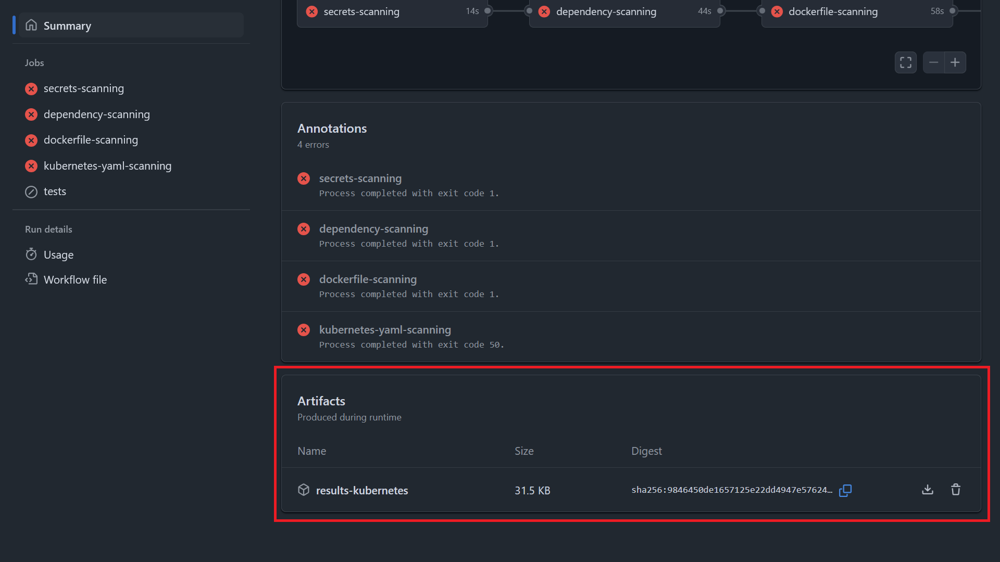
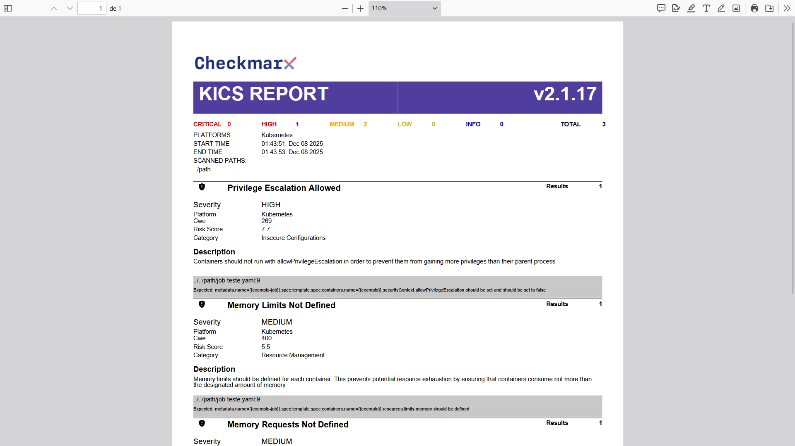

# githubactions-sast-dotnet-containers
Exemplo de workflow do GitHub Actions com testes do tipo SAST analisando vulnerabilidades no código de uma aplicação .NET containerizida.

---

## Testes

Workflow executado com falhas:

Em que foram apontados os seguintes problemas de segurança:

Artefato (arquivo .pdf) gerado durante a execução da ferramenta KICS:

Alertas de segurança no relatório gerado pelo KICS:

