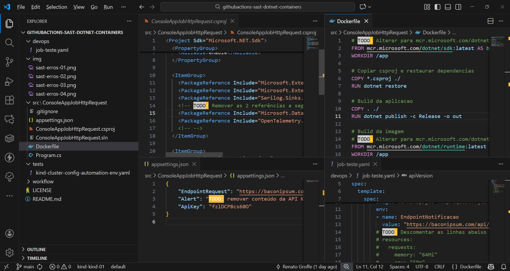
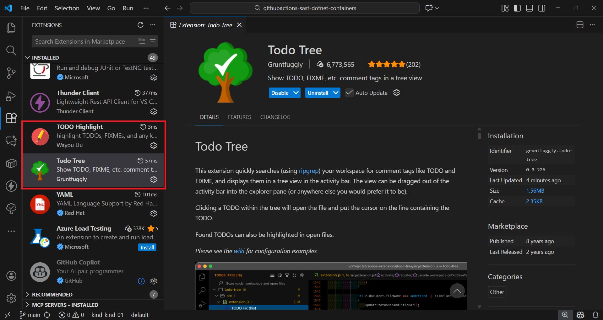
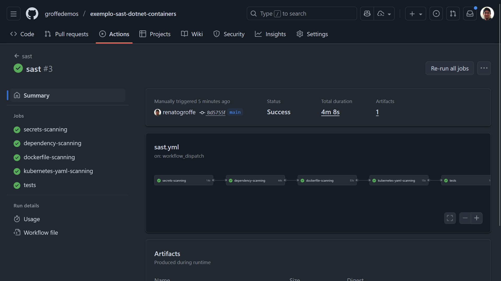
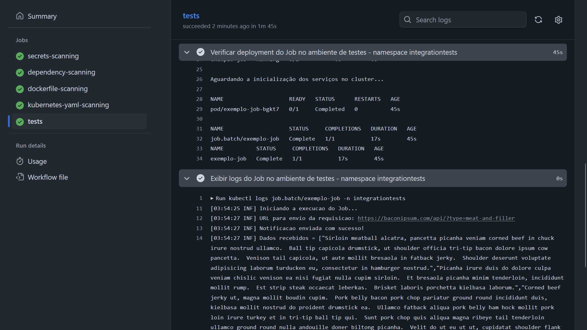
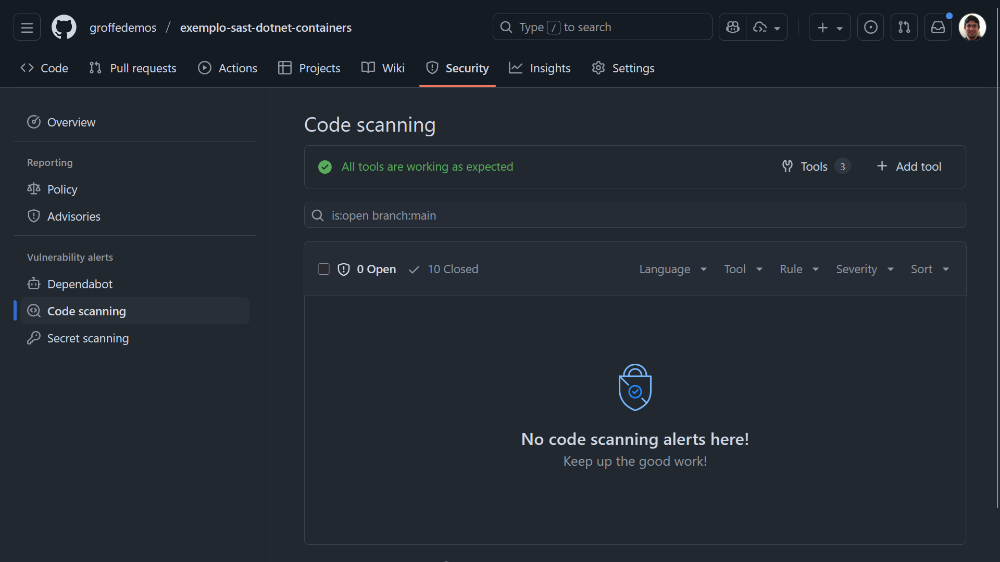

# githubactions-sast-dotnet-containers
Exemplo de workflow do GitHub Actions com testes do tipo SAST analisando vulnerabilidades no código de uma aplicação .NET containerizida.

---

## Testes

Workflow executado com falhas:

Em que foram apontados os seguintes problemas de segurança:

Artefato (arquivo .pdf) gerado durante a execução da ferramenta [**KICS**](https://kics.io/index.html):

Alertas de segurança no relatório gerado pelo KICS:

Os problemas a serem corrigidos foram marcados como TO-DOs:

Para facilitar isto fez uso das extensões [**Todo Tree**](https://marketplace.visualstudio.com/items?itemName=Gruntfuggly.todo-tree) e [**TODO Highlight**](https://marketplace.visualstudio.com/items?itemName=wayou.vscode-todo-highlight)

Workflow executado com sucesso após correções:

Testes executados com sucesso utilizando um cluster emulado via [**kind**](https://kind.sigs.k8s.io/):

Alertas de segurança solucionados:

